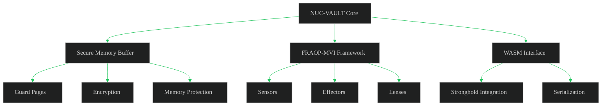
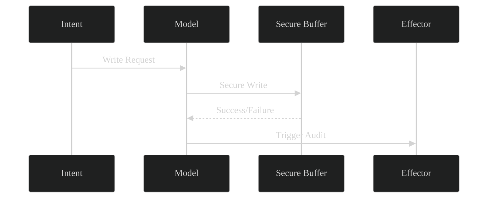
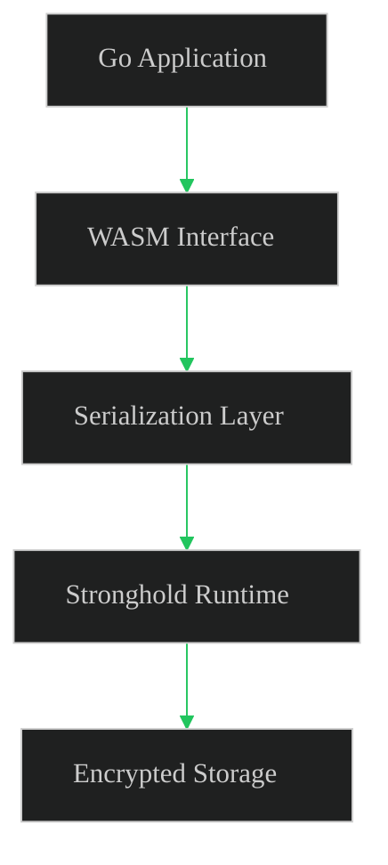
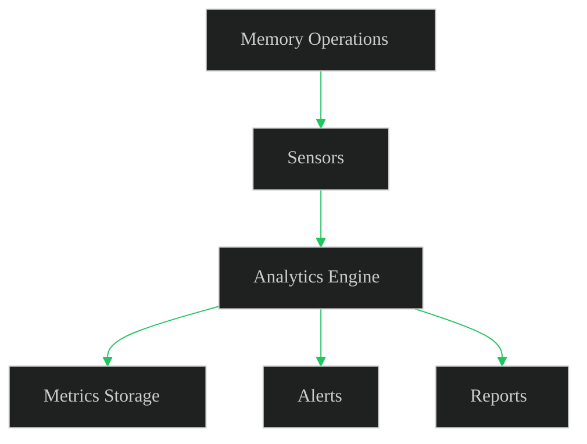

# NUC-VAULT Implementation Plan

## Overview

This implementation plan outlines the step-by-step approach for building the NUC-VAULT secure memory buffer, following AI-driven diagram-as-code and test-driven development paradigms.

## 1. Core Components



## 2. Implementation Phases

### Phase 1: Core Secure Memory Buffer

#### Tasks:
1. Implement basic secure buffer structure
2. Add guard page protection
3. Implement encryption layer
4. Add memory protection mechanisms

#### Test Cases:
```go
// Test Suite 1: Basic Buffer Operations
func TestSecureBuffer(t *testing.T) {
    tests := []struct {
        name     string
        data     []byte
        wantErr  bool
    }{
        {"basic_write_read", []byte("test"), false},
        {"empty_buffer", []byte{}, false},
        {"large_buffer", make([]byte, 1024*1024), false},
    }
    // Implementation details...
}
```

### Phase 2: FRAOP-MVI Integration



#### Tasks:
1. Implement MVI cycle
2. Add sensor framework
3. Implement effectors
4. Create analytics lenses

#### Test Cases:
```go
// Test Suite 2: MVI Integration
func TestMVICycle(t *testing.T) {
    ctx := context.Background()
    model := NewModel()
    
    tests := []struct {
        name   string
        intent Intent
        want   *View
    }{
        {
            name: "write_operation",
            intent: Intent{Operation: "write", Data: []byte("test")},
            want: &View{Status: "success"},
        },
        // More test cases...
    }
    // Implementation details...
}
```

### Phase 3: WebAssembly Interface



#### Tasks:
1. Set up WASM runtime
2. Implement serialization layer
3. Create Stronghold interface
4. Add error handling

## 3. Development Workflow


## 4. Testing Strategy

### Unit Tests
- Secure buffer operations
- Encryption/decryption
- Memory protection
- FRAOP-MVI components

### Integration Tests
- Full MVI cycle
- Sensor-Effector interactions
- WASM interface

### Performance Tests
```go
func BenchmarkSecureOperations(b *testing.B) {
    benchmarks := []struct {
        name string
        size int
    }{
        {"small_buffer", 100},
        {"medium_buffer", 10000},
        {"large_buffer", 1000000},
    }
    // Implementation details...
}
```

## 5. Monitoring and Analytics



## 6. Project Structure

```
nuc-vault/
├── cmd/
│   └── nuc-vault/
│       └── main.go
├── internal/
│   ├── buffer/
│   ├── fraop/
│   ├── wasm/
│   └── metrics/
├── pkg/
│   ├── crypto/
│   └── memory/
└── test/
    ├── integration/
    └── performance/
```

## 7. Success Metrics

- All test suites passing
- Performance benchmarks within specified limits
- Security audit completion
- Integration test coverage > 80%
- Zero memory leaks in long-running tests

## 8. Next Steps

1. Set up project structure
2. Implement core buffer functionality
3. Add FRAOP-MVI framework
4. Integrate WASM interface
5. Complete testing suite
6. Performance optimization
7. Security audit